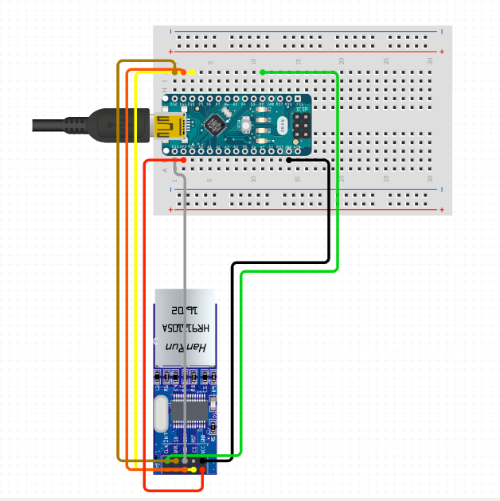

Local Area Network (LAN) is a a collection of devices physically connected to each other in a single location such as a home, office, building etc. Ethernet is a robust modern technology which allows us to connect the various devices over LAN and communicate to each other through an Ethernet Cable. In this article, we are going to see how to establish communication between an host which will be an Arduino microcontroller and a linux server acting as the client.

To establish this communication, we will be performing a simple loopback test using the Unified Data Protocol (UDP) wherein, whatever we send from the Arduino to the linux server will be displayed on the client end which is our server and then sent back to the micrcontroller which is the host creating a loop of data transfer. 

For testing, any arduino based microcontroller can be used but we will be using an Arduino Nano. By default, arduino based microcontrollers do not support Ethernet communication directly, hence, we will be using Wiznet's W5500 Ethernet to SPI module to interface ethernet with our microcontroller. 

## Components Required

1. Arduino Nano Microcontroller x 1
2. Wiznet W5500 Ethernet Module x 1
3. Ethernet Cable (Crossover cable preffered) x 1
4. Ubuntu Linux Computer (UDP Server) x 1
5. Jumper Cables

## Hardware Setup



| W5500 | ARDUINO |
| ----------- | ----------- |
|  5V    |   5V    |
|  GND   |   GND   |
|  SCK   |   D13   |
|  MISO  |   D12   |
|  MOSI  |   D11   |
|  CS    |   D10   |
|  RST   |   D9    |  

- Connecting the RST pin is optional, only if you want to Reset the W5500 module through code. It is preffered to reset the module before configuring the network parameters for communication.

## Arduino Programming

### Libraries Required:-
We are going to use the following external ethernet libraries for our program:

1. [Ethernet Generic](https://www.arduino.cc/reference/en/libraries/ethernet_generic/)
2. [Ethernet Client](https://www.arduino.cc/reference/en/libraries/ethernet/ethernetclient/)
3. [Ethernet Server](https://www.arduino.cc/reference/en/libraries/ethernet/ethernetserver/)

Let us start with writing the Arduino Code.

**Step 1: Import the required libraries.**

```
#include <Ethernet_Generic.h>
#include <EthernetClient.h>
#include <EthernetServer.h>
#include <SPI.h>
```

**Step 2: Create a function which sends a confirmation to the Client when a message has been received.**

```
void sendConfirmation(EthernetClient client) {
  // Confirmation message to be sent
  String confirmation = "Message Received\n";

  // Send the confirmation to the client
  client.print(confirmation);

  // Also print the confirmation to the Serial Monitor for debugging
  Serial.print("Sent to client: ");
  Serial.print(confirmation);
}
```

**Step 3: Configure the network parameters for the Host (Arduino).**

```
// Network settings
byte mac[] = { 0xDE, 0xAD, 0xBE, 0xEF, 0xFE, 0xED }; // MAC address which should be unique
IPAddress ip(192, 168, 1, 177); // Set the Arduino IP (Make sure no other device on the network uses this IP address)
EthernetServer server(80);      // Set the server port
```

**Step 4: Setup the parameters for the Serial Monitor, Start the Ethernet and the Server.**

```
void setup() {
  // Start serial communication for debugging
  Serial.begin(9600);

  // Start Ethernet
  Ethernet.begin(mac, ip);

  // Start the server
  server.begin();

  Serial.print("Server is at ");
  Serial.println(Ethernet.localIP());
}
```

**Step 5: Write the loop function which continously checks for any incoming character if the client is connected and stores all the charaters in a string.**

```
void loop() {
  // Listen for incoming clients
  EthernetClient client = server.available();
  
  if (client) {
    Serial.println("Client connected");
    String message = "";  // Variable to hold the incoming message

    // While the client is connected
    while (client.connected()) {
      if (client.available()) {
        char c = client.read();  // Read the incoming data
        Serial.print(c);         // Print the received data to Serial Monitor
        message += c;            // Append the character to the message

        // Check if the message is complete (e.g., by checking for newline '\n')
        if (c == '\n') {
          // Send confirmation to the client
          sendConfirmation(client);

          // Clear the message variable for the next message
          message = "";
        }
      }
    }

    // Close the connection
    client.stop();
    Serial.println("Client disconnected");
  }
}
```

### Complete Code:-

```
// Author: Utkarsh Anand
/*
Description:-
This code is for communicating between Arduino Nano microcontroller and a UDP server like Ubuntu Linux system through ethernet LAN connection using a Wiznet W5500 Ethernet to SPI module. 

Code:- https://github.com/ChiratheRobotics/Safety_Embedded_board/tree/15_ethernet_integration/Mule_V3/Ethernet_Integration/Arduino_W5500/Arduino_W5500_UDP_Loopback_Test

*/


// Include all the required libraries

#include <Ethernet_Generic.h>
#include <EthernetClient.h>
#include <EthernetServer.h>
#include <SPI.h>

// Fuction Prototype
void sendConfirmation(EthernetClient client);

// Network settings
byte mac[] = { 0xDE, 0xAD, 0xBE, 0xEF, 0xFE, 0xED }; // MAC address which should be unique
IPAddress ip(192, 168, 1, 177); // Set the Arduino IP (Make sure no other device on the network uses this IP address)
EthernetServer server(80);      // Set the server port

void setup() {
  // Start serial communication for debugging
  Serial.begin(9600);

  // Start Ethernet
  Ethernet.begin(mac, ip);

  // Start the server
  server.begin();

  Serial.print("Server is at ");
  Serial.println(Ethernet.localIP());
}

void loop() {
  // Listen for incoming clients
  EthernetClient client = server.available();
  
  if (client) {
    Serial.println("Client connected");

    String message = "";  // Variable to hold the incoming message

    // While the client is connected
    while (client.connected()) {
      if (client.available()) {
        char c = client.read();  // Read the incoming data
        Serial.print(c);         // Print the received data to Serial Monitor
        message += c;            // Append the character to the message

        // Check if the message is complete (e.g., by checking for newline '\n')
        if (c == '\n') {
          // Send confirmation to the client
          sendConfirmation(client);

          // Clear the message variable for the next message
          message = "";
        }
      }
    }

    // Close the connection
    client.stop();
    Serial.println("Client disconnected");
  }
}

void sendConfirmation(EthernetClient client) {
  // Confirmation message to be sent
  String confirmation = "Message Received\n";

  // Send the confirmation to the client
  client.print(confirmation);

  // Also print the confirmation to the Serial Monitor for debugging
  Serial.print("Sent to client: ");
  Serial.print(confirmation);
}

```

## Ubuntu Setup

**Step 1: Ethernet Connection**
1. Ensure that ethernet cable is connected between the LAN port of W5500 and Ubuntu System.

**Step 2: Network Configuration**
1. Open terminal on Ubuntu System
2. Check your ethernet interface 

```
$ ifconfig 
```
In my system, the ethernet interface was called '**enp89s0**'.

3. Assign a static IP to your ethernet interface. 

```
$ sudo ifconfig enp89s0 192.168.1.199 netmask 255.255.255.0
```

**Note**:- The IP addresses of Ubuntu System and Arduino should be on the same subnet.

**Step 3: Test the connection**
1. Ping the Arduino Nano to ensure the connection is working.
```
$ ping 192.168.1.177
```

You should receive replies from the Arduino, confirming the network setup is correct.

**Step 4: Send and Receive Data**
1. You can use **'telnet'** or **'netcat'** to communication with the Arduino server.
2. Download **'netcat'** using the following command

```
$ sudo apt-get install netcat
```
3. Connect to the arduino using the comamnd ***nc {IP Address of Arduino} {Port}***.
```
$ nc 192.168.1.177 80
```
4. Type any test, and you should see the echoed response from the arduino on the serial monitor.


