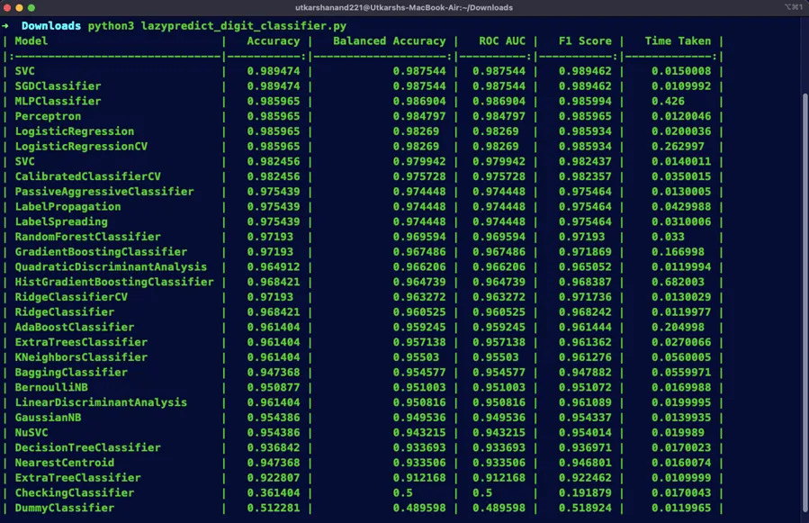

The article was initiallay published by ACM Manial [here](https://medium.com/p/06efdc5054b2).

In machine learning, selecting the right model for a given dataset can be a daunting task. With a plethora of algorithms to choose from and various hyperparameters to tune, the process often demands significant time and effort. On top of this, with the recent AI boom, the application of machine learning and deep learning algorithms has increased significantly especially in non-computer science applications. Researchers in diverse domains want to leverage this powerful tool into their work but lack a background in machine learning or high-level programming.

However, there’s a silver lining: _Lazy Predict_, a Python library that offers a shortcut to model selection by automating the evaluation of multiple algorithms on a dataset. In this article, we’ll explore Lazy Predict in detail, including its features, use cases, and example codes.

### What is Lazy Predict ?

Lazy Predict is a Python library designed to streamline the process of evaluating and comparing multiple machine learning models simultaneously on a single dataset. Developed by [Shankar Rao Pandala](https://github.com/shankarpandala), it leverages the scikit-learn library to build, train and evaluate a variety of classifiers and regressors. With Lazy Predict, users can quickly get an overview of how different algorithms perform on their dataset without the need for extensive manual coding.

### How does it work ?

Using Lazy Predict is incredibly simple, after importing the necessary modules, users can directly load their dataset and specify the target variable which needs to be predicted or classified. Lazy Predict then automatically splits the data into training and testing sets, initializes a collection of pre-defined classifier and regressor models, trains each model on the training data, and evaluates their performance on the test data. Finally, it generates a comprehensive report containing various performance metrics for each model, enabling users to compare their effectiveness effortlessly.

### Code Example

For this article, we are using Lazy Predict for running classification models on the famous [Optical Recognition of Handwritten Digits](https://archive.ics.uci.edu/dataset/80/optical+recognition+of+handwritten+digits) dataset by [MNIST](https://yann.lecun.com/exdb/mnist/). The data set contains images of hand-written digits: 10 classes where each class refers to a digit.

To use the Lazy Predict library, it has to be installed using the python-pip package.

<pre class="chroma">
<code>
pip install lazypredict
</code>
</pre>

Let’s start coding the application.

1. Import the required python packages

<pre class="chroma">
<code>
from lazypredict.Supervised import LazyClassifier
from sklearn.datasets import load_digits
from sklearn.model_selection import train_test_split
</code>
</pre>

2. Load the dataset and separate the target and feature variables

<pre class="chroma">
<code>
data = load_digits()
X, y = data.data, data.target
</code>
</pre>

3. Split the data into training and testing sets. Here, we are using a training to testing split ratio of 8:2

<pre class="chroma">
<code>
# Split data into training and testing sets
X_train, X_test, y_train, y_test = train_test_split(X, y, test_size=0.2, random_state=123)
</code>
</pre>

4. Initialize the LazyClassifier. We are not using any custom metric, hence it has been set to _None_. Set _verbose_ parameter to false to hide the detailed information while the model is being trained. Also, set the *ignore_warnings* flag to _True_ to display any warnings which may come up.

<pre class="chroma">
<code>
# Initialize LazyClassifier
clf = LazyClassifier(verbose=0,ignore_warnings=True, custom_metric=None)
</code>
</pre>

5. Start the model training and generate the model performance summary.

<pre class="chroma">
<code>
# Fit LazyClassifier
models_summary, predictions = clf.fit(X_train, X_test, y_train, y_test)
</code>
</pre>

6. Display model performance summary

<pre class="chroma">
<code>
# Display model performance summary
print(models_summary)
</code>
</pre>

### Use Cases of Lazy Predict
1. **Exploratory Data Analysis (EDA)**: Lazy Predict serves as a valuable tool during the initial stages of a machine learning project, providing insights into which algorithms may be suitable for further exploration.

2. **Model Selection**: By comparing the performance of various models, Lazy Predict helps practitioners identify the most promising candidates for fine-tuning and optimization.

3. **Education and Learning**: Lazy Predict can be used as an educational resource to introduce beginners to different machine learning algorithms and their performance characteristics.

### Benefits of using Lazy Predict
1. **Time-Saving**: Lazy Predict automates the process of model selection, saving practitioners valuable time that would otherwise be spent on manual evaluation.

2. **Efficiency**: With Lazy Predict, users can quickly assess the performance of multiple models in a single step, facilitating rapid experimentation and iteration.

3. **Accessibility**: Lazy Predict’s user-friendly interface makes it accessible to users of all skill levels, from novices to seasoned machine learning practitioners.

### Conclusion
Lazy Predict offers a convenient and efficient solution for evaluating machine learning models, making it an invaluable asset in the data scientist’s toolkit. By automating the process of model selection and performance evaluation, it enables practitioners to expedite the development of robust and accurate machine learning solutions. Whether you’re a beginner exploring the world of machine learning or a seasoned researcher seeking to streamline your workflow, Lazy Predict is a tool worth considering.

### References:
Lazy Predict GitHub Repository: [https://github.com/shankarpandala/lazypredict](https://github.com/shankarpandala/lazypredict)
Pandala, Shankar Rao. “Lazy Predict.” GitHub, 2021, [https://github.com/shankarpandala/lazypredict](https://github.com/shankarpandala/lazypredict).

