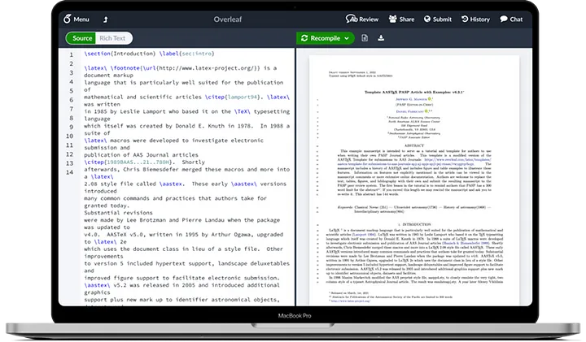
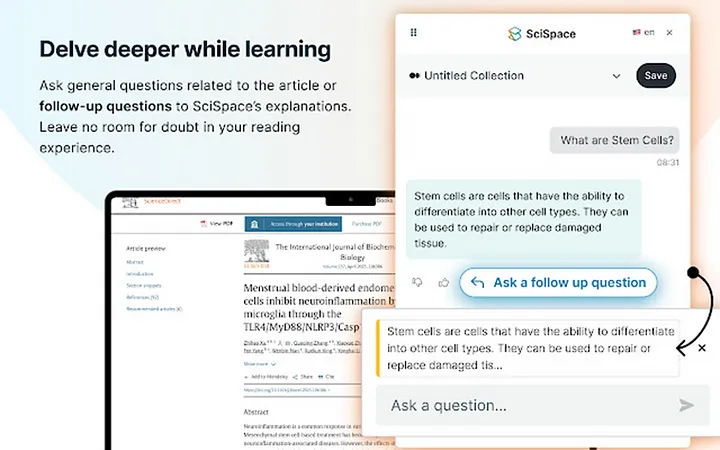
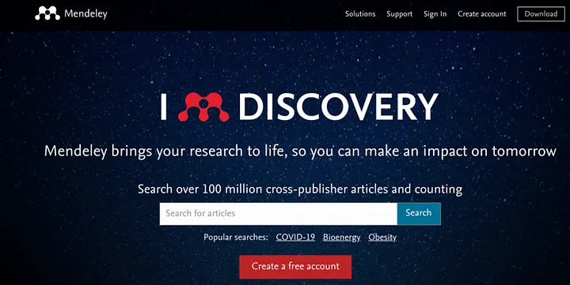
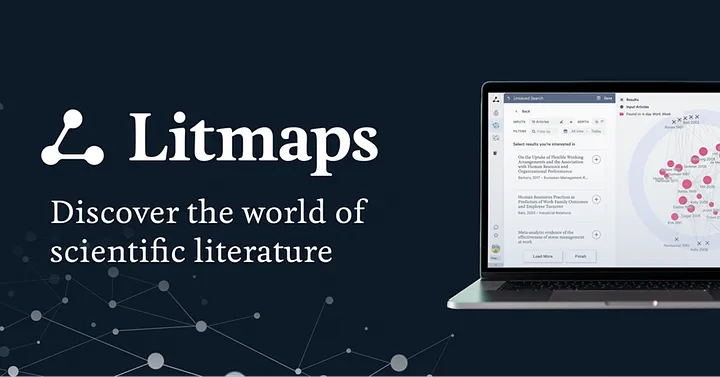
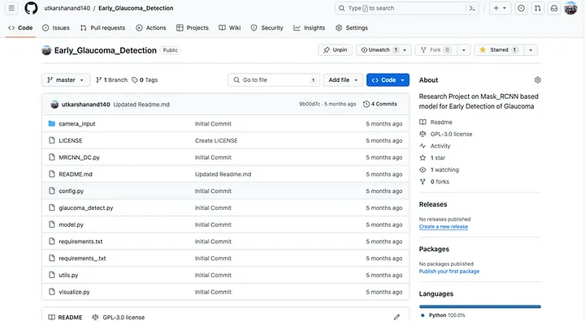
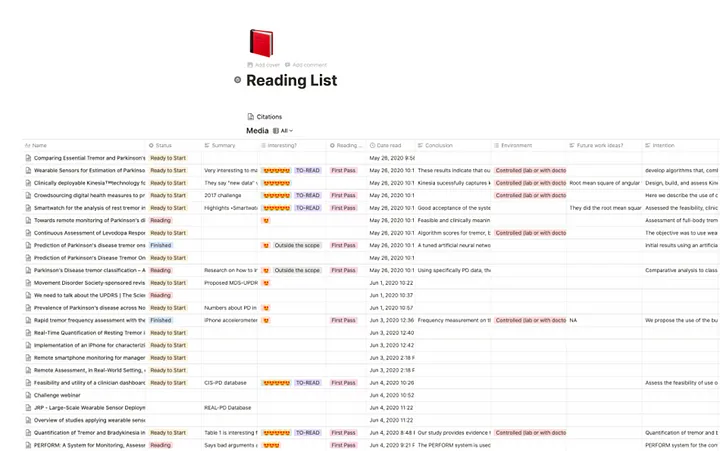
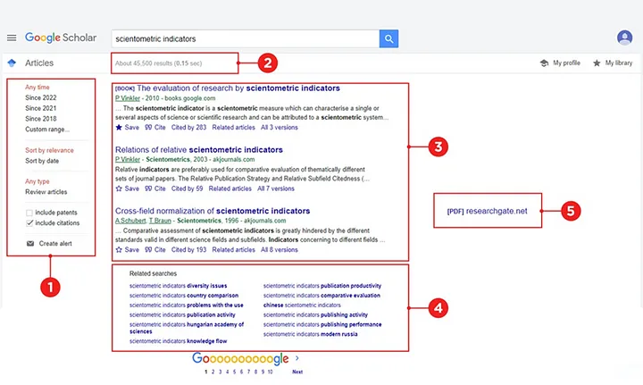
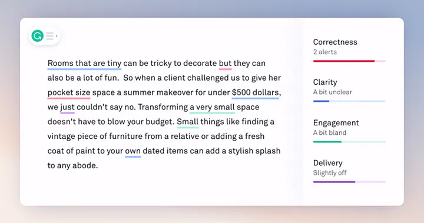
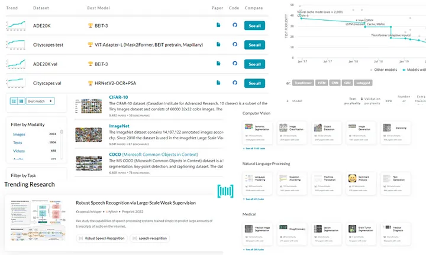

{}
The article was originally published by ACM Manipal on behalf of the author [here](https://medium.com/@acm.manipal/navigating-the-landscape-of-research-top-tools-and-resources-for-researchers-in-2024-48018769cd84).
{}

In the ever-evolving world of research, staying organized, efficient, and up-to-date with the latest developments is paramount. Fortunately, the digital age has ushered in a plethora of tools and resources designed to streamline the research process. In this article, we’ll explore some of the essential resources and tools that have helped me through my undergraduate research journey.

#### 1. <u>Overleaf</u>

LaTeX is the standard format for document writing in academia and Overleaf has revolutionized collaborative writing. This online LaTeX editor allows researchers to create, edit, and share LaTeX documents seamlessly. Its real-time collaboration features enable multiple authors to work on a document simultaneously, making it ideal for collaborative research projects. With Overleaf, formatting complexities are minimized, allowing researchers to focus on content creation without worrying about the intricacies of LaTeX coding.

#### 2. <u>Scispace</u>

A literature review is an essential component of any research project. As essential as it is, understanding research papers can be difficult sometimes. Scispace played a very crucial role in making this simpler for me. It is a comprehensive research management platform that integrates various tools and services to facilitate every stage of the research process. From literature review and data analysis to collaboration and project management, Scispace offers a centralized hub for researchers to organize their work efficiently. Its AI-powered chatbot can read through entire papers and generate summaries, inferences, etc. easily Users can also ask different questions to the chatbot about the research presented in the papers.

#### 3. <u>Mendeley / Zotero</u>

Mendeley is a leading reference management tool that helped me collect, organize, and cite sources effectively. It offers features for storing and annotating PDFs, generating bibliographies, and collaborating with peers. Mendeley’s social networking capabilities also allow researchers to discover new publications and connect with colleagues in their field.

Another popular tool for similar use cases is Zotero which offers great open source capabilities but I used and preferred Mendeley due to its cross-device synchronization capabilities handling papers on multiple devices.

#### 4. <u>Connected Papers / Litmaps</u>

Connected Papers and Litmaps are visualization tools that helped me in exploring the interconnectedness of academic literature. By analyzing citation networks and identifying key relationships between papers, these platforms offer valuable insights into the landscape of scholarly research. Researchers can use Connected Papers and Litmaps to discover seminal works, identify emerging trends, and navigate complex research domains with ease.

#### 5. <u>Github</u>

Although having a reputation for being the go-to tool in the software development industry, GitHub has increasingly become a valuable resource for researchers working on projects involving code or data analysis. Its version control capabilities facilitate collaboration and reproducibility by enabling my fellow co-researchers to track changes, manage revisions, and share code repositories.

#### 6. <u>Notion</u>

When working on multiple research projects, keeping track of all the progress becomes critical and messy at times. That is where Notion helped me. It is a versatile productivity tool that combines note-taking, project management, and collaboration features in a single platform. Its flexible structure allows researchers to create customized databases, organize information intuitively, and collaborate with team members seamlessly. Whether used for brainstorming ideas, outlining research proposals, or managing lab workflows, Notion adapts to the unique needs of researchers across diverse disciplines.

#### 7. <u>Google Scholar</u>

Google Scholar remains a go-to resource for researchers seeking access to scholarly literature across a wide range of disciplines. Its vast database of academic publications, patents, and citations enables researchers to discover relevant sources, track citations, and stay informed about the latest research trends. Powered by the Google search engine, its advanced search capabilities and personalized recommendations make it an indispensable tool for conducting comprehensive literature reviews and staying updated on cutting-edge research.

#### 8. <u>Grammarly</u>

Clear and concise writing is essential for effective communication in academia. Grammarly is a writing assistant tool that helps researchers improve the clarity, correctness, and coherence of their written work. From grammatical errors and punctuation mistakes to style suggestions and tone adjustments, Grammarly provides real-time feedback and suggestions to enhance the quality of research manuscripts, grant proposals, and academic papers.

#### 9. <u>Papers with Code</u>

As the importance of reproducibility and transparency in research continues to gain prominence, Papers with Code offers a valuable resource for researchers seeking to share and reproduce code implementations of academic papers. This platform provides code repositories linked to research papers, allowing researchers to access, replicate, and build upon existing work with ease. It also promotes open sourcing in academia, especially in the computer science field. Papers with code provide the ability to implement and upload on the website for research papers whose code is not published by the authors. It provides monetary incentives to people contributing to the code repositories.

In an era of rapid technological advancement and information overload, leveraging the right tools and resources is essential for navigating the complexities of the research landscape. Whether it’s managing references, analyzing data, or collaborating with peers, the tools mentioned above can empower researchers to work more efficiently, communicate effectively, and make meaningful contributions to their respective fields.

