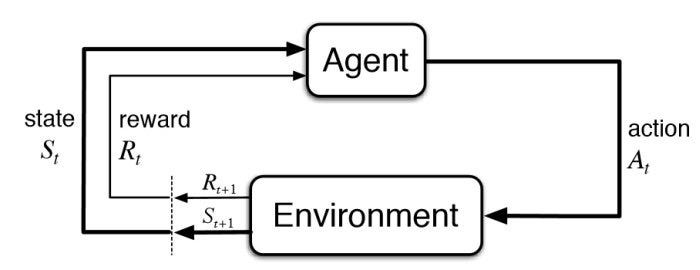

This will be series of articles based on the notes that I had made when I was learning RL from the [Reinforcement Learning Course by David Silver](https://www.youtube.com/playlist?list=PLqYmG7hTraZDVH599EItlEWsUOsJbAodm) from [Google DeepMind](https://deepmind.google/). The articles are not just repetitions of the content delivered in the course, but my versions of the topics and how I understood them.

Since Reinforcement Learning is a very math intensive course, I have broken down the concepts and the mathematical equations to layman terms and explained them in my own words so as to make them as simple as possible.

In addition to the course by David Silver, I had also used the book titled, "**An Introduction to Reinforcement Learning**" by Sutton and Barto which is like a bible for any beginner who wants to get into this field. This book tries to explain the mathematical concepts with as many real like example as possible. Online version of the book can also be found [here](http://incompleteideas.net/book/RLbook2018.pdf).

## Introduction to Reinforcement Learning
Reinforcement Learning are a class of Machine Learning algorithms in which we have an Agent interacting with an Environment; which provides a numeric reward to the agent telling it how good or bad it was performing.

The goal of the agent in Reinforcement Learning is to learn to take actions in the environment which will maximize the reward. A real life analogous example of RL would be how you would train a puppy. You reward the puppy with a treat when it does what you expected it to do  and punish it by not giving the treat when it does not do what you had asked for.

Following is a simple diagram representing the various entities in Reinforcement Learning:

Here, at time step ***t***, the agent was initially in state ***Sₜ*** and thus got a reward ***Rₜ*** by the environment. Based on that reward:

1. The agent takes an action ***Aₜ*** .
2. Based on the action taken, it receives some reward ***Rₜ₊₁*** from the environment in the next time step.
3. Then moves on to the next state ***Sₜ₊₁***.

This cycle keeps continuing during the entire reinforcement learning process until a termination condition / state is reached.

## Difference between Reinforcement Learning and other Machine Learning algorithms

1. A major difference in the case of Reinforcement Learning and other traditional Machine Learning algorithms, especially the Supervised Learning ones is that, there is no 'Supervisor' in this case. No one tells the algorithms about which actions to take. This is just a trial and error paradigm. The best thing to do is not told by anyone and the only way to know if it was a good or a bad action is by looking at the reward signal.

2. The feedback in Reinforcement Learning is not instantaneous, and is delayed. This means that, if the agent makes a decision now at a current time step, many steps later it will know if it was a good or a bad decision taken previously based on the cumulative reward at the end.

3. As we work we sequential decision making in Reinforcement Learning, time really matters. The data which the agent trains upon is highly correlated.

The actions taken by an agent at the current time step affects the subsequent data that it will receive in the future. An example to understand this would be, if an RL agent is controlling a robot which is moving in a particular direction, based on the action taken by the agent to move the robot in different directions, the data received will be related to those particular directions only.

## The Reinforcement Learning Problem
_In this section, we will be talking about the aspects of a Reinforcement Learning model such as Rewards functions, State functions, Environments etc._

### Reward Functions

The Reward function (***Rₜ***) is a scalar feedback signal which indicates how well an agent is doing at any time step ***t***. The objective of an RL agent is to maximize the cumulative reward. This means that the RL agent will take necessary actions so that the total reward received in the end is as high as possible.

The concept of Reinforcement Learning is based on the '***Reward Hypothesis***', which states that : " _All goals can be described by the maximization of expected cumulative reward_ ". In simple terms, every goal has some or the other intermediate reward and the achievement of that particular goal can be done by getting maximum amount of those intermediate rewards. An example for this can be, lets suppose someone's goal is to loose certain amount of weight, the intermediate goal can be working out daily and loosing small amounts of weight each week and by maximising this intermediate rewards each week, the ultimate goal of reducing that certain amount of weight can be achieved over time.

### History and State
As analogous to real life, History in RL is a sequence of previous observations, actions reward which happened during the training of the RL model. This is the informations which the RL agent has seen so far. Mathematically, it represents all the observable variables up the current time step ***t***.

$$
\mathbf H_t = (\{\mathbf A_1, \mathbf O_1, \mathbf R_1 \}, ...., \{\mathbf A_t, \mathbf O_t, \mathbf R_t \}) 
$$
 
What happens next in the Reinforcement Learning is dependent on the history of the model. We aim to develop an algorithm which represents the mapping of the history to the future actions of the model. The agent will learn from the history and accordingly choose actions. Finally, according to the action taken by the agent, the environment will reward or penalize the agent. 

Instead of using history, which is a long piece of information and might be not be completely useful, we use '**State**', to determine what happens next. State is nothing but a function of the History.

$$
\mathbf S_t = f(H_t)
$$

### Environment State

The Environemnt State (`$\mathbf S_{t}^{e}$`) is the private representation of the environment in which the agent is reacting. It represents the data which the environment uses to pick the next observation or reward.

The reaosn it is called 'private representation' is because, usually this data is not visible to the agent. Even if it might be visible, it may contain data which is irrelevant to the environment.

When we deal with multi-agent systems in the future, an individual agent can consider all other agents as part of the environment.

The environment state `$\mathbf S_{t}^{e}$` is **Markov** by definition, what this means, we will discuss in upcoming sections.

### Agent State

The Agent State `$\mathbf S_{t}^{a}$` is the internal representation of the agent in a RL model. It is nothing but a set of numbers inside the agent, which it uses as information to pick its next action. This information is used by the reinforcement learning algortihms. Agent State can be any function of the history.

$$
\mathbf S_{t}^{a} = f(H_t)
$$

### Markov State / Information State

Information State (a.k.a Markov State) is a collection of all the useful information from the history which is used by the model to take future decisions. 

### Markov Property 

Markov Property states that, any state `$\mathbf S_{t}$` is Markov, if and only if, 

$$
\matbh P[\mathbf S_{t+1} | \mathbf S_t ] = \mathbf P[\mathbf S_{t+1} | \mathbf S_1, ..., S_t]
$$

This basically means that, the probability of the occurence of the next state `$\mathbf S_{t+1}$` conditioned the given state `$\mathbf S_{t}$` is same as the _probability of the next state `$\mathbf S_{t+1}$` if you show all the previous states to the system_.

In simple meaning, to find the probability of the next state occuring, you can throw away information about all the previous states and just retain the information about the current state and you will see a similar future. There is a famous line which describes this property which says that "***The future is independent of the past given the present***".

Lets take an real-life example to understand this, suppose you want to control a RC helicopter using RL, in such a case, the velocity, angular velocity, angular position and wind speed would all roughly be a markov state of the helicopter. The position or velocity of the helicopter 10 minutes ago doesn't matter or affect the position of the helicopter in the next moment, just the information of the current states are enough. 

## Approaches in Sequential decision making   

### Problems or Objectives

There are two fundamental problems in sequenctial decision making: 

1. Reinforcement Learning Problem: 
In a RL problem, the environment is initially unkown. It is not told how the environment works. The agent interacts with the environment to figure out the best plan of action based on hit and trial method. This is analogous to the real life use case of controlling a nuclear power plant in which you are asking a RL agent to control and handle the entire nuclear powerplant without giving information to the agent about how the power plant actually works.

2. Planning Problem:
In this, the model of the environment is known to the agent in advance and you tell the agent all the rules of the game, dynamics of the environment etc. Instead of interacting with the environment, the agent performs internal computations on its models and figures out what to do next, improving its policy during this course of action. 

The agent without ever interacting with the environment actually, simulates the different situations and possiblities of what can happen, and builds a tree of these different sitautiosn and possiblities. At last it just performs a tree search to reach that particular situation taking the necessary actions required for it.

### Exploration vs Exploitation

Reinforcement Learning is a type of trial and error learning. The agent should discover a good policy by itself from its existance of the environment without loosing too much reward along the way. There are two basic pathways that an agent can take to achieve this goal:

Exploration means choosing the give up some known reward in the journey inorder to find out more information about the environment and use that information later on to maximize the rewards.

Exploration means exploiting the known information during the journey and maximizing the rewards along its way.

It is very important to keep a decent balance between these two. An agent should explore as well as exploit.

